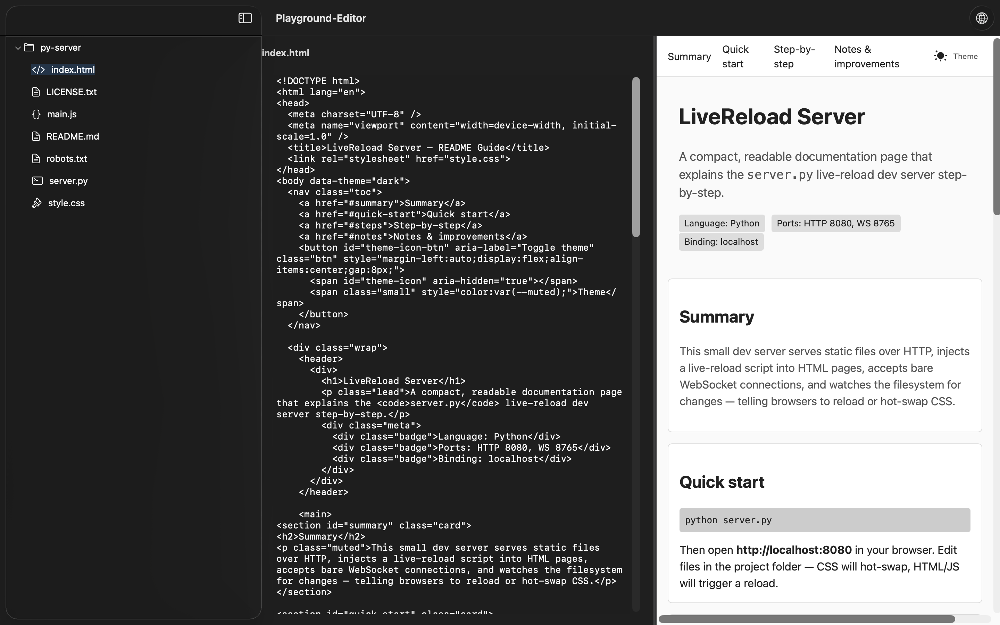

# swiftui-text-editor-webview

SwiftUI macOS starter project: Text editor with live save and Safari WebView preview.

## Prerequisites
- macOS 13+  
- Xcode 15+  
- Python 3.10+ (optional, for live-reload server)  

## Features
- Text editor with **live save**  
- **Resizable WebView** for rendering `localhost:8080`  
- Sidebar file browser  
- Folder structure supports multiple modules and tests  

## Prototype

- Version (September 21, 2025)

  

- Version (October 2, 2025)

  

  

---

## Getting Started

### 1. Clone the Repository
```bash
git clone <your-repo-url>
cd swiftui-text-editor-webview
```

### 2. Open the Xcode Project
1. Open the main `.xcodeproj` in Xcode  
2. Initialize the live-reload server (if using)  
3. Build & Run the app  
4. Sidebar displays files in your project folder  
5. Editor and WebView panels are **resizable**  

---

### 3. Sandbox Options

**Option 1 (Recommended – Sandbox Enabled)**  
- Keep the macOS Sandbox enabled (`Enable Outgoing Connections (Client)`)  
- Check container path via Xcode Terminal:  
```
~/Library/Containers/com.yourcompany.app/Data/Documents
```  
- Copy your project files into this folder  

**Option 2 (Sandbox Disabled)**  
- Disable Sandbox in Xcode  
- Use a folder under `~/Documents`, e.g.:  
```
~/Documents/MyProjectFiles
```  
- Copy your project files into this folder  

---

### 4. Optional: Python Live-Reload Server
- [Python Live-Reload Server](https://github.com/x91823903819038219083190/live-reload-development-server)  
- Copy the server into your project folder (or sandbox container if enabled)  
- Start the server in Terminal:
```bash
cd <path-to-server>
python3 server.py
```
- The server runs at `localhost:8080`  
- The app’s WebView automatically renders this URL  
- Modify the URL in `ContentView.swift` if needed  

---

## Project Structure (Updated)
```
swiftui-text-editor-webview/
├── MyProjectFiles/         # Main project files for editing
│   ├── Views/              # SwiftUI views
│   ├── Components/         # Reusable UI components
│   ├── Helpers/            # Utility classes and extensions (currently empty)
│   ├── Models/             # Data models and structures
│   ├── Services/           # Application services (currently empty)
│   └── Test/               # Test files (no tests written yet)
├── screenshots/            # App screenshots and diagrams
├── .gitignore
├── LICENSE
└── README.md
```
> Note: The **Test** folder is included so you can start adding unit/UI tests as your project grows.

---

## Improvement Ideas
- Syntax highlighting  
- Linter integration  
- Debugger support  
- GUI polish  
- LSP (Language Server Protocol) support  
- Vim-style motion & shortcuts  
- Integrated terminal  

---

## Attribution
All code was **generated with ChatGPT (OpenAI)** and structured for demonstration purposes.  

---

## License
MIT License – see [LICENSE](./LICENSE) for details.
