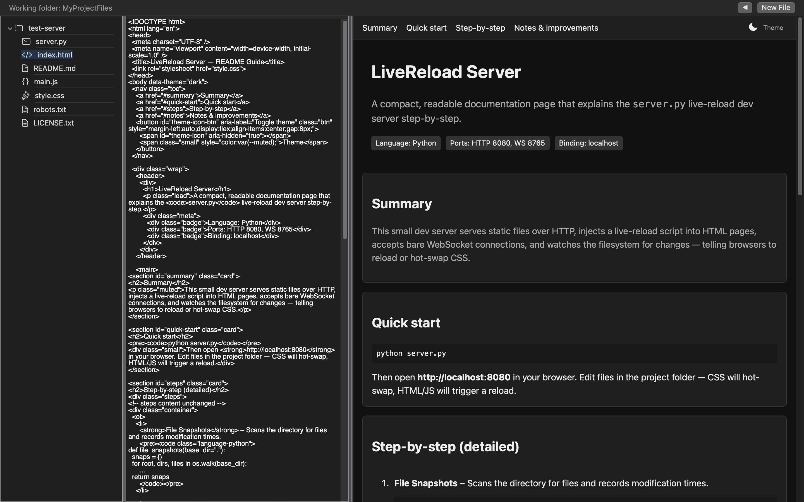
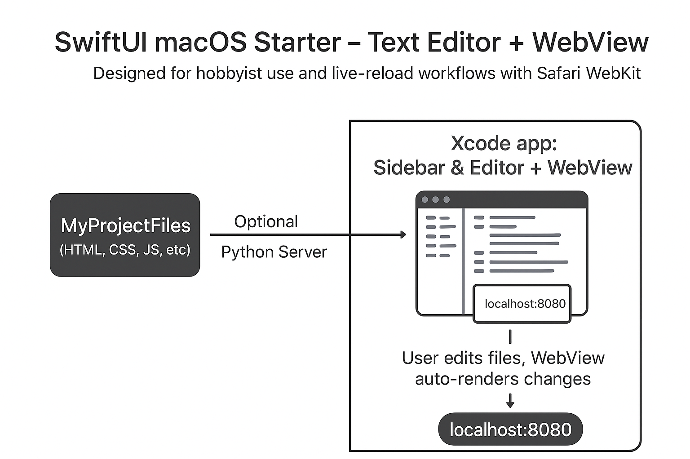

# swiftui-text-editor-webview

SwiftUI macOS starter project: Text editor with live save and Safari WebView preview.

## Prerequisites
- macOS 13+  
- Xcode 15+  
- Python 3.10+ (only if using the live-reload server)


## Features
- Text editor with live save  
- Resizable WebView for rendering `localhost:8080`  




--- 

## Getting Started

### 1. Clone the repository
```bash
git clone <your-repo-url>
cd <your-repo-name>
```

2. Open the Xcode Project
* Use Xcode → Open Existing Project
* Initialize the server first before Build & Run the app 
* Build & Run the app
* The sidebar will display the files in MyProjectFiles, and the editor & WebView are resizable.

--- 

3. Sandbox Options

Option 1 (Recommended)
* Keep the sandbox enabled (Enable Outgoing Connections (Clients))
* Use the Xcode Terminal to check the container path, e.g.:  
  ~/Library/Containers/com.yourcompany.app/Data/Documents  
* Copy your project files into that container directory  

Option 2
* Disable Sandbox in Xcode
* Use a folder in Documents, e.g., ~/Documents/MyProjectFiles
* Create your project folder there and paste files

--- 

4. Optional: Python Live-Reload Server
* [Python Live-Reload Server](https://github.com/x91823903819038219083190/live-reload-development-server)
* Copy the server into your project folder (or container if sandboxed)
* Navigate to the folder in Terminal:
cd <path-to-server>
python3 server.py
* This starts a server at localhost:8080
* WebView in the app will automatically render it
* You can change the URL in ContentView.swift if needed

## References
[Xcode Sandbox Documentation](https://developer.apple.com/documentation/xcode/configuring-the-macos-app-sandbox)

## Improvement Ideas
* Syntax Highlighter
* Linter
* Debugger
* GUI Polish
* LSP (Language Server Protocol)
* Vim-style motion and shortcuts
* Terminal 

## Attribution

All code in this repository was **generated with ChatGPT (OpenAI)** and organized into this project structure for demonstration purposes.  


## Generated with AI

This project was created using **AI-assisted generation**.  
The explanations, documentation, and code were written and structured with the help of **ChatGPT (OpenAI)** to demonstrate how modern AI tools can speed up prototyping and learning.  

--- 

## License
This project is licensed under the MIT License. See the [LICENSE](./LICENSE) file for details.
